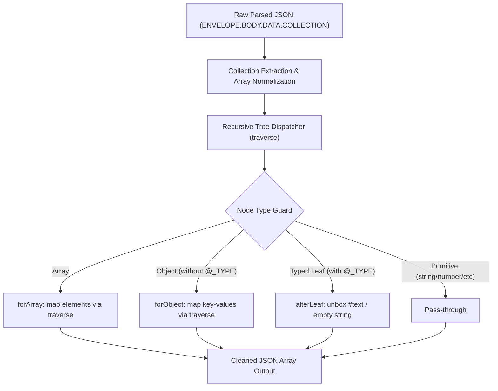

# Architecture & Internals

This document details the internal design and processing pipeline of `tally-clean-response`.

← **[Back to README](../README.md)** &bull; 🌐 **[Live Documentation](https://keshavsoft.github.io/tally-clean-response/)** &bull; 💡 **[Examples & Recipes](EXAMPLES.md)**

---

## 1. Pipeline Overview

The pipeline transforms deeply nested, XML-serialized Tally data into a clean, predictable JavaScript array of objects through three primary stages:



---

## 2. Collection Extraction (`src/v2/index.js`)

1. **Locate Data Root**:
   Extracts `json?.ENVELOPE?.BODY?.DATA?.COLLECTION`.

2. **Handle Single Records**:
   When Tally's XML parser encounters only one child (e.g. one `<VOUCHER>` instead of many), the parsed object structure creates a single nested object rather than an array.
   The extractor detects when `COLLECTION` contains a single non-array property and automatically wraps it in an array:
   ```javascript
   if (originalKeys.length === 1 && !Array.isArray(collection[originalKeys[0]])) {
       collection[originalKeys[0]] = [collection[originalKeys[0]]];
   }
   ```

3. **Identify Collection Key**:
   Using `pullKey()`, it dynamically discovers the main collection key (such as `VOUCHER`, `LEDGER`, `STOCKITEM`, etc.) by looking for any property not starting with `@` that contains an Array of rows:
   ```javascript
   const [key, rows] = Object.entries(collection).find(
       ([key, value]) => !key.startsWith("@") && Array.isArray(value)
   ) ?? [];
   ```

---

## 3. Recursive Dispatcher Architecture (`src/v2/changeType/v1/`)

The cleaning engine uses a modular recursive walker:

### 3.1. Guards (`guards.js`)
Centralized predicates to verify node shapes without unexpected exceptions:
- `isNullOrUndefined`: Checks for `null` or `undefined`.
- `isArray`: Checks with `Array.isArray()`.
- `isObject`: Verifies non-null, non-array object.
- `isTallyType`: Confirms whether the node has the `"@_TYPE"` property characteristic of Tally XML-typed fields.

### 3.2. Central Dispatcher (`traverse.js`)
Delegates each node based on the guards:
```javascript
const traverse = ({ inData }) => {
    if (isNullOrUndefined({ inData })) return inData;
    if (isTallyType({ inData })) return alterLeaf({ inValue: inData });
    if (isArray({ inData })) return forArray({ inDataAsArray: inData });
    if (isObject({ inData })) return forObject({ inDataAsObject: inData });
    return inData;
};
```

### 3.3. Leaf Normalization (`alterLeaf.js`)
Handles the unboxing of Tally's typed nodes:
- If `#text` is missing (such as `<TAG TYPE="String"/>`), it returns an empty string `""`.
- Casts `string`, `date`, `logical`, and `rate` types to `String(rawText)`.
- Keeps `number`, `amount`, and `quantity` types as their native parsed value.

### 3.4. Nested Collections (`forArray/` and `forObject/`)
- Recursively processes arrays (e.g. `ALLINVENTORYENTRIES.LIST`, `BATCHALLOCATIONS.LIST`, `LEDGERENTRIES.LIST`).
- Recursively processes objects, rebuilding clean key-value pairs while preserving attributes like `@_REMOTEID`.
